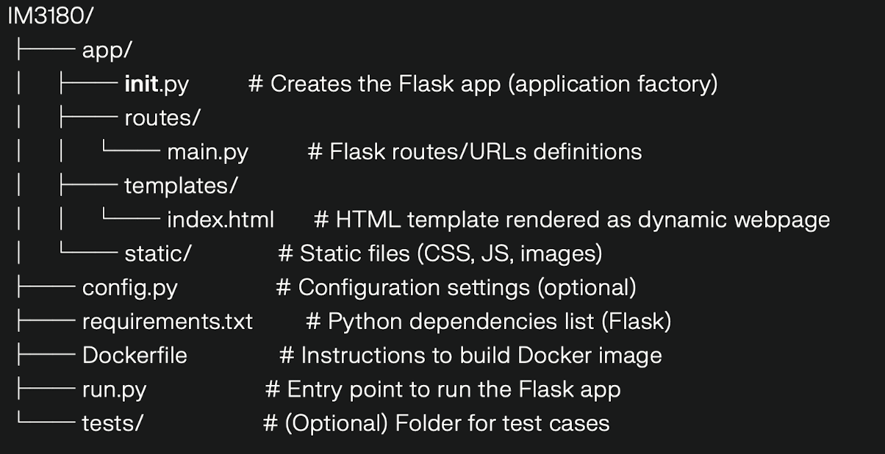

# IM3180 Flask Web App with Docker

This project is a simple Flask web application containerized using Docker. It serves dynamic web pages accessible on `localhost:8080`.

---

## Prerequisites

- Install **Docker Desktop** on your machine:
  - [Docker Desktop for Windows](https://docs.docker.com/desktop/install/windows-install/)
  - [Docker Desktop for Mac](https://docs.docker.com/desktop/install/mac-install/)
  - For Linux, install Docker Engine via your distro’s package manager: https://docs.docker.com/engine/install/

Make sure Docker is running after installation.

---

## Project Structure




---

## Running the App using Docker

1. **Open a terminal/command prompt** and navigate to the project root folder `IM3180`.

2. **Build the Docker image:**

```
docker build -t im3180-flask-app .
```

This command creates a Docker image named `im3180-flask-app` using the `Dockerfile` in the current folder.

3. **Run the Docker container:**

```
docker run -p 8080:8080 im3180-flask-app
```

This command starts a container and maps port 8080 inside the container to port 8080 on your local machine.

4. **Open your web browser and visit:**

```
http://localhost:8080
```

You should see the dynamic Flask web page.

5. To stop the application, return to the terminal and press `Ctrl + C`.

---

## Notes

- The Flask app is configured to run on port 8080 inside the container.
- Static and template files are organized under the `app/` folder to follow Flask best practices.
- No local installation of Flask or Python is required; Docker handles all dependencies inside the container.
- To update the app, edit the source files and rebuild the Docker image using step 2.

---

## Troubleshooting

- If port 8080 is in use, you can change the port mapping by modifying the run command, e.g.:

```
docker run -p 9090:8080 im3180-flask-app
```

Then access on `http://localhost:9090`.

- Ensure Docker Desktop is running and your user has permissions to run Docker commands.

---

Enjoy using the IM3180 Flask Docker Web App!